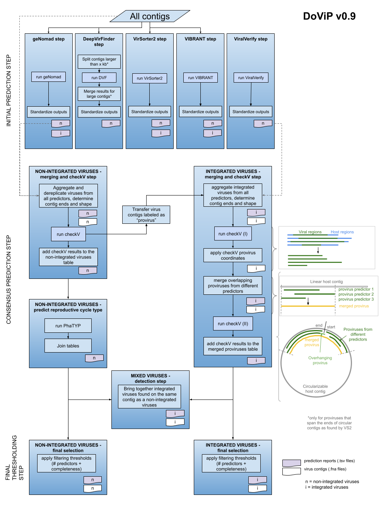

# DoViP - Do Virus Prediction

DoViP is a workflow designed to integrate the results from several virus predictors: geNomad, DeepVirFinder, VirSorter2, VIBRANT and ViralVerify. Its main features are:
  * Processing non-integrated viruses (entire contigs defined as "lytic" by various predictors) separately from integrated virus regions (parts of the input contigs deemed by various predictors as temperate/pro-viruses).
  * Removing host regions (based on CheckV results) and merging overlapping integrated virus regions (including those that span the ends of circularizable contigs).
  * Selecting final non-integrated virus contigs and integrated virus regions based on i) the number of predictors detecting them; and ii) their completeness, as determined by CheckV. 

The choice of the five virus predictors is fully customizable (any combination between 1 and 5 predictors is allowed), as well as the choice for the final selection parameters.  
A DoViP workflow is split into three steps:
  * **Initial prediction step**. This is where DoViP runs and/or post-processes the results from the five initial predictors (geNomad, DeepVirFinder, VirSorter2, VIBRANT and ViralVerify).
  * **Consensus prediction step**. This is where DoViP brings together the results from all initial predictors. 
  * **Final thresholding step**. This is where DoViP is selecting the final viral contigs/regions.

  

